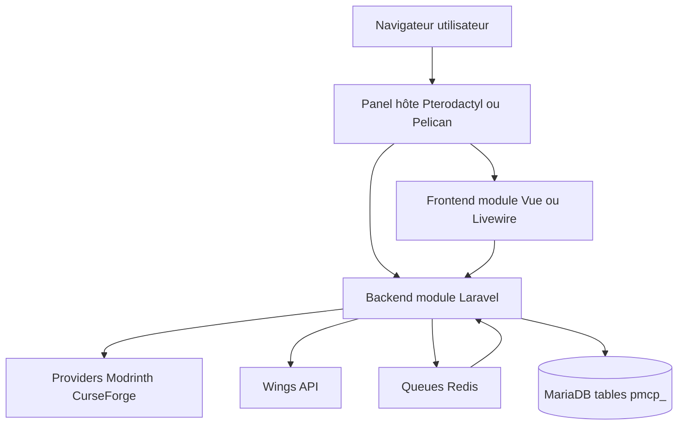
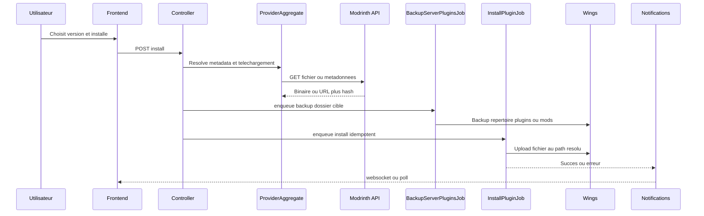
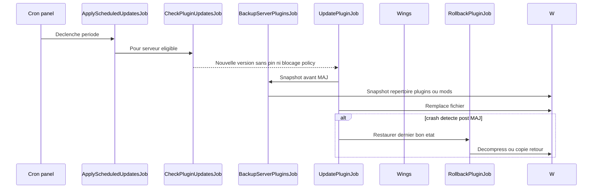
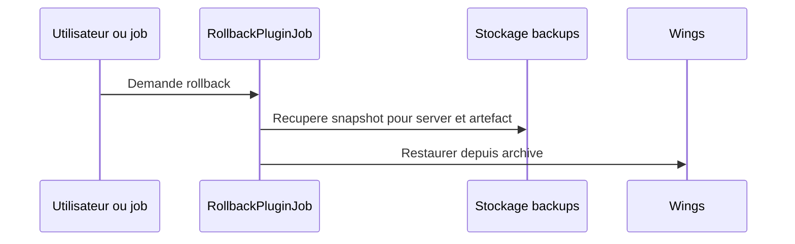
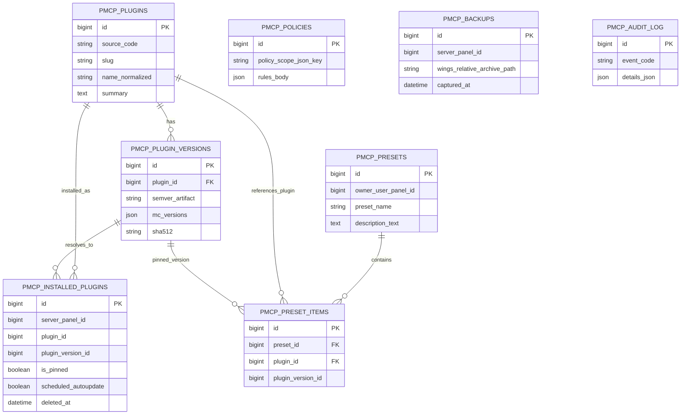
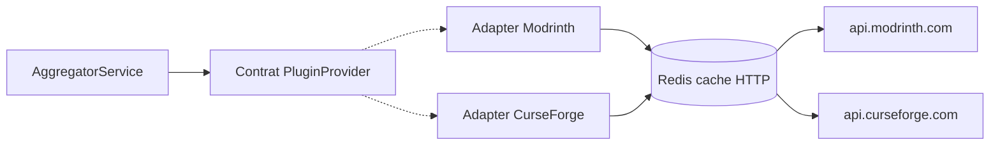

# Architecture — vue d’ensemble et flux

Voir `docs/PTERODACTYL-PRIMER.md` pour Blueprint/Wings/permissions et `docs/MINECRAFT-PRIMER.md` pour les chemins par loader.

## Vue d’ensemble



Le module ne parle **pas** au disque du conteneur jeu en contournant Wings : toute écriture passe par l’API officielle du daemon (cf. `CLAUDE.md` § 8).

## Data flow : install d’un plugin

Réponse installer : champ optionnel **`backup`** (`id`, `archive`) lorsque **`backup_before: true`** est envoyé avec un **`backup_context`** parmi `catalog` | `history` | `scheduled` : compression Wings du dernier segment du dossier cible (`.tar.gz` sur le volume), ligne en **`pmcp_backups`**.



Les noms exacts seront précisés quand les contrôleurs seront scaffoldés dans le codebase.

## Data flow : scheduled update



La détection de crash sera **heuristique** à calibrer (état Wings, lignes console) lors de l’implémentation.

## Data flow : rollback



## Schéma DB

Pas de FK physiques vers `servers` / `users` du panel ; seulement des IDs opaques (ADR-003).



Population de `PMCP_AUDIT_LOG` hors portée **v1.0**.

## Architecture Providers



DTO stables garantissent aucun leak de JSON tiers vers le frontend.

## Double Panel frontend

Backend unique ; UI dupliquée volontairement entre `src/frontend/pterodactyl/` (Vue 2.7 Options API) et `src/frontend/pelican/` (Livewire/Alpine) — rationales dans `src/frontend/CLAUDE.md`.

## Contexte Minecraft (`server/context`)

L’endpoint client **GET** associé au module (déclaré dans les routes Blueprint `ext/routes/client.php`) renvoie un **contexte lecture seule** pour l’UI catalogue : aucun appel Wings, pas de modification disque.

Le handler délègue la construction du payload à `PteroMcPlugins\Services\ServerMcContextBuilder::build($server)` (fichier `ext/app/Services/ServerMcContextBuilder.php`, chargé via `require_once` depuis la route pour rester compatible avec les panels où l’autoload Composer de l’extension n’est pas garanti).

### Forme du payload

| Champ | Rôle |
|--------|------|
| `minecraft_versions_hint` | Liste de chaînes candidates (tri insensible à la casse) : versions `1.x`, canaux (`latest`, `snapshot`, …), adresses IPv4 détectées dans le startup analysé, extractions depuis URLs (Modrinth/…), motifs Paper/Purpur/Fabric/Quilt. Filtres pour éviter les faux positifs courts type options JVM. |
| `egg_variables` | Sous-ensemble des variables d’environnement de l’œuf / serveur pour les clés d’intérêt (`MINECRAFT_VERSION`, `MC_VERSION`, `BEDROCK_VERSION`, …). |
| `egg_name` / `nest_name` | Libellés affichage / heuristiques (ex. détection Bedrock). |
| `context_meta` | `bedrock_like_egg` : heuristique œuf/nest ou présence `BEDROCK_VERSION`. `startup_has_placeholders_left` : après expansion `{{ ENV }}` depuis l’env fusionné (valeurs serveur + défauts œuf), il reste des marqueurs `{{ … }}` non résolus (startup template). |

Les indices proviennent de : **variables fusionnées** (valeur instance + repli sur `default_value` des variables œuf), puis **startup** après substitution des placeholders, avec motifs additionnels sur la « haystack » (URLs, noms de jars).

### Sonde runtime (`server/probe-mc-version`)

Complément **opt-in** (bouton UI) lorsque les hints ci-dessus sont insuffisants :

- **Route** : **GET** `…/server/probe-mc-version?server={uuid}` (même préfixe d’extension que `server/context`, déclaré dans `ext/routes/client.php`).
- **Comportement** : lecture d’un fichier `latest.log` via Wings (`PmcpRuntimeVersionProbe`), parsing par `PmcpVersionLogParser` (bannières de démarrage Java + Bedrock). Détails (chemins candidats, codes HTTP, champs JSON) : `docs/PTERODACTYL-PRIMER.md` § « Détection runtime ».
- **Différence avec `server/context`** : la sonde **appelle Wings** et nécessite la permission lecture fichiers ; le contexte serveur reste **sans I/O Wings**.

### Tests

La logique du builder est couverte par des tests Pest standalone (`composer test`), avec un stub `Pterodactyl\Models\Server` sous `tests/stubs/` — le panel réel fournit le modèle Eloquent en production.

## Déploiement Blueprint

Publication d’un fichier `.blueprint` via `./scripts/package.sh` (référencé dans `CLAUDE.md` § 9 une fois présent dans le repo). Installation admin :

```
blueprint -i pteromcplugins
```

## ADR résumées

### ADR-001 Blueprint vs fork panel

Isolation des changements upstream ; désinstallation claire pour l’hébergeur.

### ADR-002 DTO `NormalizedPlugin`

Couplage faible APIs externes ; évolutivité multi-sources sans casser frontend.

### ADR-003 Pas de FK vers schéma core panel

Tolérence aux divergences Pterodactyl/Pelican et montée de versions indépendante.

### ADR-004 Double UI dès MVP

Répond aux attentes natives de chaque écosystème panel malgré coût de maintenance doublé.

### ADR-005 Redis cache et queues

Réutiliser stack standard panel ; clés préfixées `pmcp:*` pour TTL et buckets.
